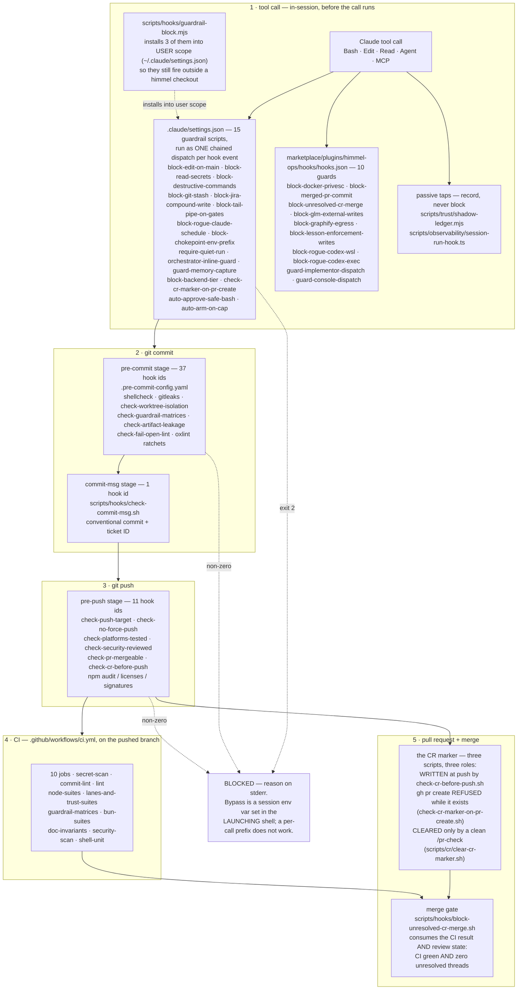
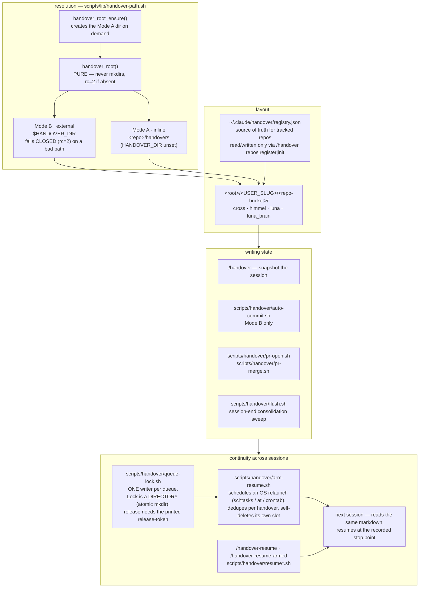
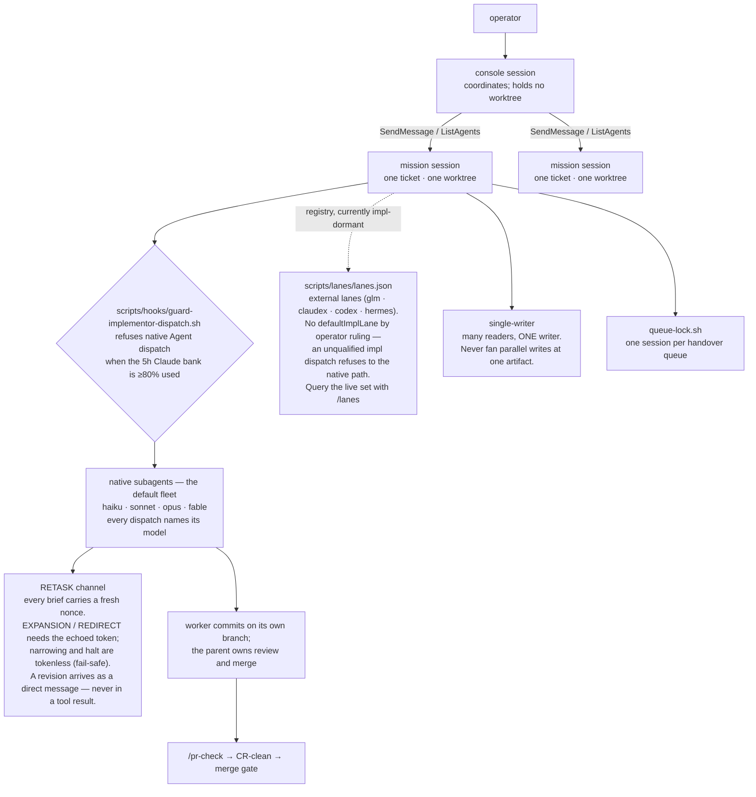
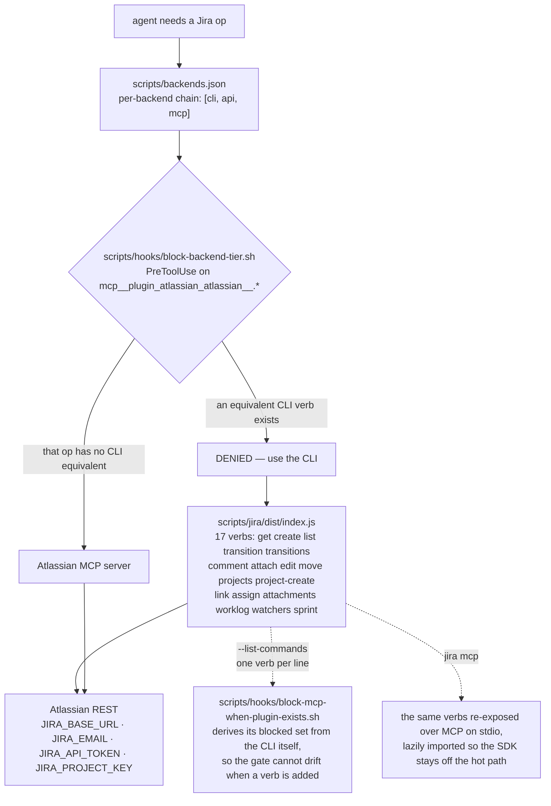
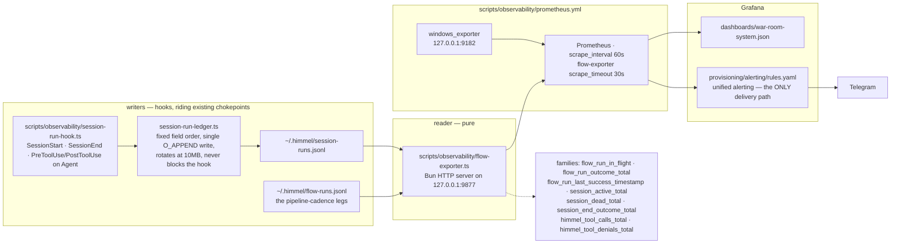

# himmel architecture — the diagrams

Five views of how the harness is wired. A box that names a repo path points at
a file you can open and read — with one exception, `scripts/jira/dist/index.js`,
a generated build artifact that only exists after a build (see "Keeping these
accurate" below). The diagrams also contain actor and external-system boxes
(`Claude tool call`, `operator`, `Prometheus`, `Telegram`, `Atlassian REST`,
…) that deliberately name no file.

These are the structural views. Four **behavioural** chains already have
diagrams in [`configuration.md`](configuration.md) and are not repeated here:
the ticket→ship chain, the tool-call permission chain, the Telegram bridge
router, and the delegation-lane routing tree. Read those for "what happens to
one call"; read this file for "what the layer is made of".

- [1. The enforcement layers](#1-the-enforcement-layers)
- [2. The handover system](#2-the-handover-system)
- [3. The fleet and the console](#3-the-fleet-and-the-console)
- [4. The Jira / backend seam](#4-the-jira--backend-seam)
- [5. The observability chain](#5-the-observability-chain)

---

## 1. The enforcement layers

himmel enforces structurally, at five independent stages. A rule that lives at
only one stage can be forgotten; the same invariant is often checked at two.
The live inventory is `.claude/settings.json`, the plugin `hooks.json` files,
and `.pre-commit-config.yaml` — this diagram is the shape, not the list.

**Why five stages and not one.** Each stage sees something the others cannot. A
PreToolUse hook sees the *intent* of a single call but not the diff. A
pre-commit gate sees the staged diff but not the branch's history. A pre-push
gate sees the whole range and the remote. CI sees a clean machine. The merge
gate sees the CI result plus review state — which is why it comes last, and why
the arrow runs CI → merge gate and never the reverse. An invariant that matters
gets checked wherever it is cheapest to catch — and the ones that matter most
get checked twice.

Per-hook behaviour, the guardrail matrix, and the bypass env var for each:
[`internals/enforcement.md`](internals/enforcement.md). Recovery when one
stops you: [`internals/stuck-playbook.md`](internals/stuck-playbook.md).

---

## 2. The handover system

Handover is how work survives a session boundary. State is plain markdown in a
directory the resolver picks; nothing about it is opaque or lossy.

**The invariant that makes it work.** One leg is one file: state and orders
never split across two documents, so a resuming session cannot read half the
picture. The queue lock is structural rather than advisory because prose
coordination between two armed sessions failed three ways in one night — the
escalation is recorded in `scripts/handover/queue-lock.sh`'s own header.

Full flows and the resolver contract:
[`internals/handover-system.md`](internals/handover-system.md).

---

## 3. The fleet and the console

More than one Claude session runs at a time. The fleet model says who may
write what, who may spawn whom, and how a revision reaches a running agent.

**Caps that are not model-tuned.** Spawn depth and concurrency come from
`CLAUDE_CODE_MAX_SUBAGENT_SPAWN_DEPTH` and
`CLAUDE_CODE_MAX_CONCURRENT_SUBAGENTS` — read the environment; unset means the
harness default applies. Haiku does not spawn.

Tier semantics, effort-before-tier, and cost:
[`internals/lane-calibration.md`](internals/lane-calibration.md). The RETASK
threat model: [`internals/retask-channel.md`](internals/retask-channel.md).
Native subagents vs. external lane workers:
[`internals/worker-spawn-matrix.md`](internals/worker-spawn-matrix.md).

---

## 4. The Jira / backend seam

An MCP server costs context on every session that loads it. A local CLI costs
nothing until it is called. himmel routes issue-tracker work to the CLI and
keeps MCP for the individual ops a backend's CLI does not implement — and
enforces that routing rather than asking Claude to remember it.

**The detail that keeps it honest.** The gate does not hand-maintain a list of
blocked MCP tools — it asks the CLI what verbs it has. Adding a verb tightens
the gate automatically; removing one loosens it. That is the difference
between a rule and a structure.

Invocation shape (absolute path from the primary checkout — `dist/` is an
untracked build artifact, so a worktree lacks it) and the full op ↔ MCP
mapping: [`internals/jira-plugin.md`](internals/jira-plugin.md).

---

## 5. The observability chain

The stack is local, passive, and read-only. The exporter never writes a
ledger, never mutates the vault, never starts or kills a process. Missing data
stays missing rather than being invented.

**The record that never gets written is the important one.** `SessionEnd` is a
graceful-exit hook: a crash, an OOM, or a window the operator eventually closes
emits `session_start` and no `session_end`, ever. Liveness is therefore decided
by the *reader*, from transcript mtime — not asserted by the writer. The same
reasoning splits an expired unpaired row into `abandoned` (its pid is confirmed
dead — real hygiene information, but nothing is hung and nobody can act, so it
must not page) and `stalled` (everything else).

`alerts.rules.yml` is loaded into Prometheus for self-visibility and
`promtool` testability only; no Alertmanager is installed, so nothing there is
ever delivered. Details and the passivity invariant:
[`../scripts/observability/README.md`](../scripts/observability/README.md).

---

## Keeping these accurate

When you move or rename a file a box above names, this file is part of
the change — the same rule that governs
[`commands-catalog.md`](commands-catalog.md). Every count here is derivable:
the gate ids and their split across the three git stages (37 pre-commit,
11 pre-push, 1 commit-msg) from `.pre-commit-config.yaml`, the job count from
`.github/workflows/ci.yml`, the verb count from
`node scripts/jira/dist/index.js --list-commands`. Re-derive rather than trust
them if a diagram and the code disagree.
