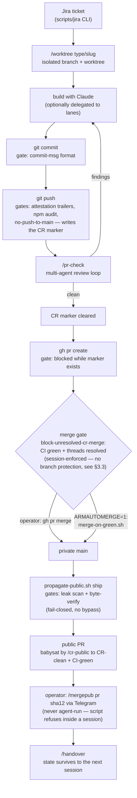
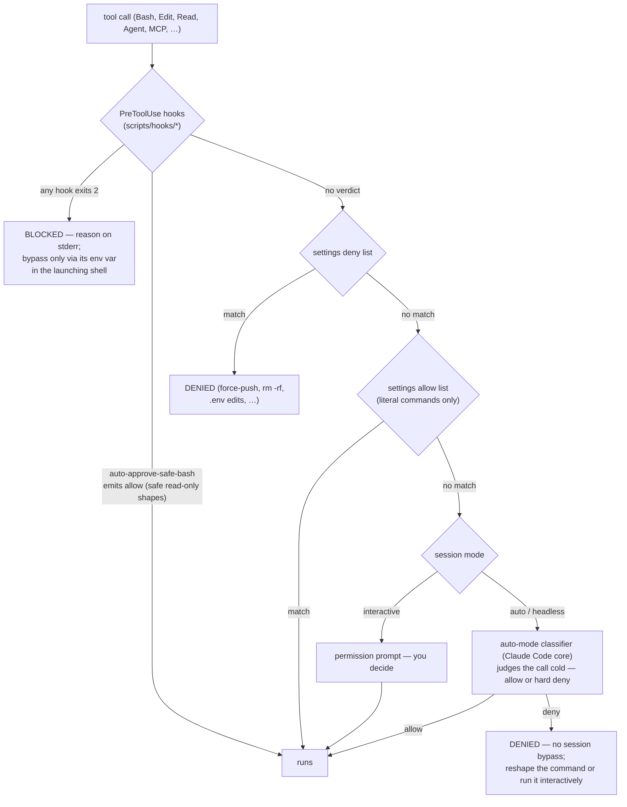
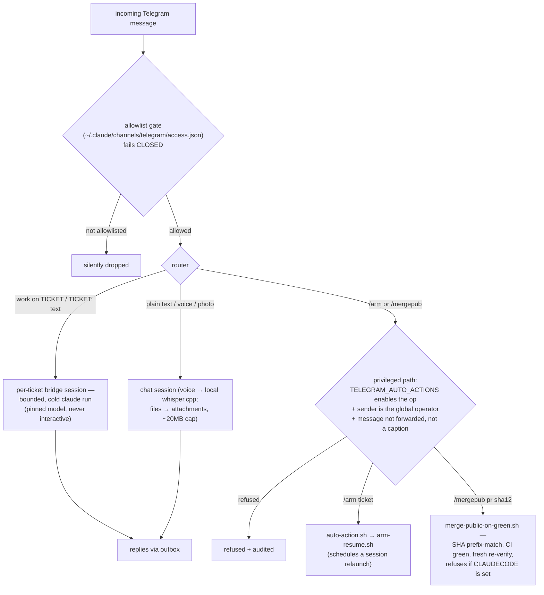
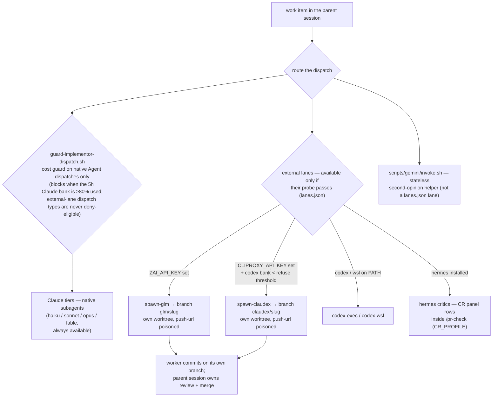

# Configuration & workflow chains

The canonical map of **what himmel does, in what order, and what you can
control**. Every claim here is traceable to code or config in this repo — the
file that enforces or reads each knob is named inline. Per-subsystem depth
lives in the [deep-dive docs](#6-deep-dive-index); this doc is the one place
that shows the whole control surface at once.

Audience: an adopter who has finished [getting-started.md](getting-started.md)
and wants to know what is running, what can act on its own, and where the off
switches are. ([README.md](../README.md) has the pitch; this doc has the
controls.)

**Contents**

1. [What himmel is](#1-what-himmel-is)
2. [The chains](#2-the-chains) — delivery, gate decision, Telegram, lanes
3. [The gates](#3-the-gates) — every veto, classified HARD / auth-gated / advisory
4. [The control surface](#4-the-control-surface) — every knob, by surface
5. [Off-switches](#5-off-switches) — how to disable each layer
6. [Deep-dive index](#6-deep-dive-index)

---

## 1. What himmel is

himmel runs Claude Code as a **managed, PR-gated agent**. Instead of trusting
the model to remember rules, it enforces the workflow *structurally*, at three
layers:

- **git hooks** (`.pre-commit-config.yaml` — pre-commit, commit-msg, pre-push)
  gate what can be committed and pushed: secrets scanning, conventional
  commits, worktree isolation, attestation trailers (commit-message lines —
  `Platforms tested:` / `Security reviewed:` — asserting you actually tested
  and reviewed; [§3.1](#31-git-gates-pre-commit--commit-msg--pre-push)), and
  a mandatory code review before a PR.
- **Claude Code hooks** (`.claude/settings.json` → `scripts/hooks/`) gate what
  a live session can do at the tool-call layer: no edits on `main`, no secret
  reads, no PR creation while a review is owed, no merging over unresolved
  review threads.
- **Chokepoint scripts** own the dangerous transitions: private auto-merge
  (`scripts/handover/merge-on-green.sh`), public propagation
  (`scripts/propagate-public.sh`), public merge
  (`scripts/merge-public-on-green.sh` — human-authorized only, via Telegram).

Everything above the guardrails is **opt-in autonomy**: initiative mode
(`HIMMEL_INITIATIVE`) makes a session drive finished work toward shipping;
arming (`scripts/handover/arm-resume.sh`) schedules a session to relaunch;
overnight mode dispatches whole tickets unattended; the Telegram bridge lets
you drive all of it from your phone. Each of those layers is OFF until you
turn it on — with one exception: the usage-cap watchdog ships enabled with
the hooks (kill switch `AUTO_ARM_DISABLE=1`) — and every layer has an off
switch ([§5](#5-off-switches)).

## 2. The chains

### 2.1 The delivery chain, end to end

One piece of work travels: ticket → worktree → build → review loop → private
PR → private merge → public propagation → public PR → **human-authorized**
public merge → handover.

> The propagation tail (`propagate-public.sh` → public PR → `/mergepub`)
> applies only if you run a private/public repo **pair**, as himmel itself
> does. A single-repo adopter's chain ends at the merge + handover — the
> earlier stages are identical.

Step-by-step, with the enforcing file:

| Step | Command / trigger | What gates it |
|---|---|---|
| Branch | `/worktree <type>/<slug>` | branch must be `type/slug`; refuses branches with a merged PR (`scripts/_new-worktree.sh`) |
| Edit | any Edit/Write | `scripts/hooks/block-edit-on-main.sh` — must be in a worktree, never `main` |
| Commit | `git commit` | conventional-commit format (`scripts/hooks/check-commit-msg.sh`); pre-commit stage: gitleaks, shellcheck, lockfile/artifact checks (`.pre-commit-config.yaml`) |
| Push | `git push` | pre-push stage: attestation trailers, npm audit, no-push-to-main, and `scripts/hooks/check-cr-before-push.sh` writes a **CR marker** recording that a review is owed |
| Review | `/pr-check` | multi-agent panel (`.claude/commands/pr-check.md`); a clean result clears the marker |
| Open PR | `gh pr create` | `scripts/hooks/check-cr-marker-on-pr-create.sh` blocks while the marker exists |
| Merge (private) | `gh pr merge` or `merge-on-green.sh` | `scripts/hooks/block-unresolved-cr-merge.sh` — CI green + zero unresolved review threads. There is **no GitHub branch protection on this repo**; this hook *is* the merge gate |
| Propagate | `bash scripts/propagate-public.sh ship …` | built-in leak scan + blob-level byte-verify, fail-closed, no bypass flag |
| Merge (public) | operator types `/mergepub <pr> <sha12>` in Telegram | `scripts/merge-public-on-green.sh` — refuses to run inside a Claude session, re-verifies SHA/base/CI/reviews immediately pre-merge |
| Handover | `/handover` | state written to your handover store (`docs/internals/handover-system.md`) |

### 2.2 What happens on every tool call

Every tool call a session makes passes through the same decision funnel.
Bypass env vars for these **Claude Code hooks** are session-level: set in the
shell that *launches* `claude` (e.g. `EDIT_ON_MAIN_OK=1 claude`) — a per-call
`VAR=1 cmd` prefix does not reach the hooks. (The **git-hook** bypasses in
[§3.1](#31-git-gates-pre-commit--commit-msg--pre-push) are different: git
hooks run in your own shell, so there a per-command prefix like
`SKIP_CR=1 git push` works — and is preferable, since it scopes the bypass to
one push instead of a whole session.)

Two structural notes, both from code:

- Claude Code's native allow-list matcher refuses to match any Bash command
  containing `$var`, `$(…)`, backticks, or compound operators — such commands
  fall through to the prompt/classifier even when allow-listed.
  `scripts/hooks/auto-approve-safe-bash.sh` exists to close that gap for
  provably safe read-only shapes; it only ever emits *allow*, never blocks.
- A deny rule or an exit-2 hook always wins over a hook's allow (per Claude
  Code's precedence rules, restated in
  `scripts/hooks/auto-approve-safe-bash.sh`'s own header). The
  auto-mode classifier is effectively a HARD gate in headless/auto sessions
  (there is no bypass; himmel's mitigation is routing sanctioned commands
  around it, e.g. `scripts/hooks/block-jira-compound-write.sh` bouncing a
  compound Jira write into the one literal shape the gateway can approve).

### 2.3 Remote control — the Telegram bridge

Optional; nothing starts it automatically. One bot token, one poller
(`scripts/telegram/`), an allowlist that **fails closed**, and privileged
commands that are default-OFF. Detail: [telegram-bridge.md](telegram-bridge.md).

Security properties (all in `scripts/telegram/poller.ts` / `gate.ts` /
`auto-action.ts`):

- A non-allowlisted sender is dropped at ingest; allowlisting a **group**
  trusts every member of that group for ordinary chat/dispatch — but `/arm`
  and `/mergepub` additionally require the sender to be the globally
  allowlisted operator.
- Forwarded `/arm`/`/mergepub` messages are refused (injection kill-switch);
  text arriving via media captions or voice transcripts is never
  auto-executed.
- `TELEGRAM_AUTO_ACTIONS` is default-OFF; `merge-public` is *explicit-only* —
  even `TELEGRAM_AUTO_ACTIONS=all` does not enable it; you must name it.
- `/mergepub` is the only *himmel-side* path to a public merge (the operator
  can always use the GitHub UI directly), and the script refuses to run if it
  detects it is inside a Claude session (`CLAUDECODE` env check).

### 2.4 Lane routing & delegation

Work can be delegated: down the Claude tiers (native subagents), or out to
external lanes through spawn chokepoints — GLM (Z.ai's GLM coding models),
claudex/codex (OpenAI Codex-side models via a local proxy), gemini (Google's
gemini-cli), and hermes (a local multi-provider critic/junior runner). The
lane *inventory* is data, not prose: `scripts/lanes/lanes.json` resolved
against machine state by `/lanes` (`scripts/lanes/resolve.mjs`). A "bank"
below is a usage-quota window — the rolling 5-hour Claude window, or the
Codex weekly allowance.

Key invariants (enforced or structural, not just prose): external workers
commit on their **own** `glm/<slug>` / `claudex/<slug>` branches in isolated
worktrees (shared-branch mode `--branch <existing>` serializes through
`scripts/lib/shared-branch-lock.sh` — single writer); the parent session owns
review and merge; both the GLM and claudex worktrees get their push URL
poisoned as a tripwire (`spawn-glm.ts` / `spawn-claudex.ts`).

## 3. The gates

Classification used throughout (derived from what each script's code does,
not how docs describe it):

- **HARD** — structurally blocks; no in-session bypass (only destructive
  measures like `--no-verify` or deleting the hook).
- **auth-gated** — blocks until explicit authorization satisfies it: an env
  var set in the launching shell, a marker file, a clean `/pr-check`, or an
  operator action from an out-of-band channel.
- **advisory** — warns, nudges, or injects context; the action proceeds.

### 3.1 git gates (pre-commit · commit-msg · pre-push)

Source of truth: `.pre-commit-config.yaml`. `git push --no-verify` skips the
whole pre-push stage — that is deliberate and visible, not a loophole himmel
tries to close.

| Gate | Stage | Class | Satisfied / bypassed by |
|---|---|---|---|
| `gitleaks` secret scan | pre-commit | HARD | remove/rotate the secret; inline `gitleaks:allow` on the same line |
| `shellcheck` | pre-commit | HARD | fix the script |
| `worktree-isolation`, `merged-branch-check`, `hookspath-misconfig`, `lockfile-integrity`, `artifact-leakage`, `uv-lock-integrity`, `pip-hashes`, `mcp-plugin-refs` | pre-commit | HARD | fix the finding (`--no-verify` only) |
| drift guards (`doc-guard`, `agents-md-fresh`, `lanes-inventory-guard`, `hud-drift`, `telegram-fork-drift`, `template-himmel-plugins`) | pre-commit (most carry no `stages:` pin, so today they fire at every installed stage, push included) | HARD | fix the finding |
| `no-headless-claude` / `no-headless-gemini` (billing rule, HIMMEL-128) | pre-commit | HARD | `# headless-claude-ok: <reason>` marker on/above the line; docs paths exempt (`scripts/hooks/check-no-headless-claude.sh`) |
| `conventional-commit-msg` — `type(scope): [HIMMEL-N ]msg` | commit-msg | HARD | fix the message (merge/fixup/revert exempt) |
| `no-push-to-main` | pre-push | HARD | none — work through a PR |
| `npm-audit` / `npm-licenses` / `npm-audit-signatures` | pre-push | HARD | fix the dependency |
| `no-force-push` | pre-push | HARD for `main`; advisory elsewhere | `SKIP_FORCE_PUSH_GATE=1` silences the non-main warning only |
| `code-review-before-push` — writes the CR marker | pre-push | auth-gated | run `/pr-check` to clean (clears it); `SKIP_CR=1 git push` (per-command) skips writing |
| `platforms-tested` attestation (`Platforms tested: <os>` on shell/script diffs) | pre-push | auth-gated | the trailer in any commit of the push range or the PR body; `[skip platforms-check]`; `PLATFORMS_TESTED_OK=1` (`scripts/hooks/check-platforms-tested.sh`) |
| `security-reviewed` attestation (`Security reviewed: <token>` on non-docs diffs) | pre-push | auth-gated | same shapes: trailer / `[skip security-review]` / `SKIP_SECURITY_REVIEW=1`; docs-only diffs exempt |
| `pr-mergeable-gate` | pre-push | advisory | refuses only a locally-proven merge conflict; `SKIP_PR_MERGEABLE=1` |

> Note on "first commit": CLAUDE.md's convention says attestation trailers
> belong in the FIRST commit after genuinely testing/reviewing. The hooks
> themselves scan the **entire push range** for the trailer — the
> first-commit rule is discipline (attest when you actually did the work),
> not positional enforcement.

### 3.2 Session gates (Claude Code hooks)

Wired in three places: the repo's `.claude/settings.json` (project scope),
`~/.claude/settings.json` (user scope — see
[§4.2](#42-claude-code-settings--hooks)), and the himmel-ops plugin's
`marketplace/plugins/himmel-ops/hooks/hooks.json` (`block-docker-privesc`,
`block-merged-pr-commit`, `block-unresolved-cr-merge`, `block-graphify-egress`,
`block-rogue-codex-wsl`, `guard-implementor-dispatch` — these six exist only
where that plugin is installed). All scripts under `scripts/hooks/`. Full
per-hook behavior: [internals/enforcement.md](internals/enforcement.md).

| Hook | Fires on | Class | Bypass (launching shell) |
|---|---|---|---|
| `block-edit-on-main` | Edit/Write on a repo that is on `main`, or in the primary checkout | auth-gated | `EDIT_ON_MAIN_OK=1`; per-repo: a gitignored `.single-writer` file at the repo root |
| `block-read-secrets` | Read/Grep/Bash/PowerShell touching `.env`, keys, credentials | auth-gated | `READ_SECRETS_OK=1` |
| `block-destructive-commands` | recursive `rm`, `schtasks` mutation, `taskkill`, forced git rewrites, `curl\|sh`, … | auth-gated | `DESTRUCTIVE_OK=1` |
| `block-rogue-claude-schedule` | one command that both registers a scheduler job and launches `claude` | auth-gated | `ROGUE_SCHEDULE_OK=1`; or use the sanctioned `arm-resume.sh` / `pipeline-cadence.sh` |
| `block-rogue-codex-wsl` | raw `wsl … codex exec` outside the dispatch chokepoint | auth-gated | `CODEX_WSL_RAW_OK=1` |
| `block-backend-tier` | an MCP (Model Context Protocol plugin-server) call for a service whose CLI ranks higher and has the verb (registry `scripts/backends.json`) | auth-gated | `MCP_ALL_OK=1` or `MCP_<SERVICE>_OK=1` |
| `block-jira-compound-write` | a Jira CLI write wrapped in `$(…)`/heredoc/chain | auth-gated (blocks the compound shape, prescribes the one literal retry) | `JIRA_COMPOUND_WRITE_OK=1` |
| `guard-memory-capture` | writes to the auto-memory store breaking its form rules | auth-gated | `MEMORY_CAPTURE_OK=1` |
| `block-docker-privesc` | privileged/secret-mounting docker runs | auth-gated | `DOCKER_PRIVESC_OK=1` |
| `block-merged-pr-commit` | `git commit` onto a branch whose PR already merged | auth-gated (hygiene) | `MERGED_PR_COMMIT_OK=1` |
| `check-cr-marker-on-pr-create` | `gh pr create` while a CR marker exists | auth-gated | clean `/pr-check` (clears the marker) |
| `block-unresolved-cr-merge` | `gh pr merge` — two sub-gates: unresolved CR threads, and CI not green | auth-gated | `CR_MERGE_GATE_OK=1` / `CI_MERGE_GATE_OK=1` (independent); `CR_PROFILE=none` skips the CR sub-gate |
| `guard-implementor-dispatch` | expensive implementor-shaped `Agent` dispatches while the 5h Claude bank is hot | auth-gated cost guard (fail-open; blocks only at ≥80% bank + provably live window, warns at ≥65%) | `IMPL_GUARD_DISABLE=1` / `IMPL_GUARD_OK=1` |
| `block-graphify-egress` + `scripts/guardrails/graphify-fence.sh` | any `graphify` run — corpus × provider egress policy | HARD (fail-closed EXIT trap) | none for hard-deny cells; narrow per-cell opt-ins only (`GRAPHIFY_SALUS_LOCAL_OK`, `GRAPHIFY_CLIPPINGS_GLM_OK`) |
| `auto-arm-on-cap` / `auto-arm-on-subagent-cap` | usage cap approaching / subagent hit a cap | watchdog (fail-open; blocks once to force a handover, after arming a resume) | `AUTO_ARM_DISABLE=1` (+ `AUTO_ARM_SUBAGENT_DISABLE=1`) |
| `auto-approve-safe-bash` | safe read-only Bash shapes | not a veto — only ever emits *allow* | comment out its stanza to disable |
| `check-update-available` | SessionStart (throttled; a plain `git fetch` of your himmel clone's own remote — nothing else is contacted, no data sent) | advisory | `UPDATE_CHECK_DISABLE=1` |
| `inject-initiative` | SessionStart | advisory (opt-in; injects the drive-to-ship directive) | unset `HIMMEL_INITIATIVE` (default OFF) |

### 3.3 Merge & publish gates

| Gate | Class | How it is satisfied |
|---|---|---|
| Private merge gate (`block-unresolved-cr-merge`) | auth-gated | CI green + zero unresolved review threads on the head SHA. **This hook is the whole gate — the repo has no GitHub branch protection** (`scripts/hooks/block-unresolved-cr-merge.sh`). As a session hook it gates merges issued *inside a Claude session*; an operator merging from a bare terminal or the GitHub UI is outside its reach — by design, since the operator is the authority it protects. It also fails **open** on degraded evaluation (missing `jq`, unparseable hook input) — a guardrail on the agent path, not a substitute for forge-side branch protection |
| Private auto-merge (`scripts/handover/merge-on-green.sh`) | auth-gated, opt-in | `ARMAUTOMERGE` truthy **and** all of: same repo, repo verified private, PR base == default branch, `check-ci.sh` exit 0, base/privacy re-verified fresh pre-merge, audit log writable, merge pinned to the certified head SHA (`--match-head-commit`), MERGED state confirmed by polling |
| Public propagation leak scan + byte-verify (`scripts/propagate-public.sh`) | HARD | no bypass. Leak scan (token regexes, operator denylist, home-path patterns) fails closed; ship additionally proves every propagated file byte-identical blob-by-blob before committing |
| Public merge (`scripts/merge-public-on-green.sh`, via Telegram `/mergepub`) | HARD human-authorization | operator-typed, non-forwarded `/mergepub <pr> <sha12>`; SHA must prefix-match the live head at read *and* fresh pre-merge re-verify; `check-ci.sh` exit 0 is the only pass; the script refuses outright if `CLAUDECODE` is set (i.e. if any agent tries to run it) |
| `check-ci.sh` (the watcher those gates call) | mechanism, not a veto | exit 0 = green + threads resolved + no changes-requested; 1 = red; 2 = cannot evaluate; 3 = unresolved threads / changes requested; 4 = CodeRabbit concluded incrementally with no head review while a prior head had outside-diff findings (request a full review or `--escalate`) |

## 4. The control surface

### 4.1 `.env` — the file-based config

[`.env.example`](../.env.example) is the complete, commented per-key map
(HIMMEL-787) — copy it to `.env` (gitignored) and fill what you use. Its four
groups describe **how each key reaches code**, which is the #1 trap:

| Group | How it reaches code | Examples |
|---|---|---|
| TOOL-LOADED | a himmel CLI reads `.env` directly (via `scripts/lib/load-dotenv.sh`) — no export needed | `JIRA_*`, `BITBUCKET_*`, `ZAI_API_KEY` |
| PROCESS-ENV | scripts read the **live environment**; a value only in `.env` is invisible unless the key is one of the explicitly bridged exceptions listed in the file's header (e.g. `HANDOVER_DIR`, `USER_SLUG`, `CR_PROFILE`, the `HIMMEL_INITIATIVE` family) | `LUNA_VAULT_PATH`, `OVERNIGHT_*` |
| SESSION-ONLY | per-launch bypasses/opt-ins, inventoried in the file. For **Claude Code hook** bypasses, set in the shell that **launches** `claude` — a per-call prefix never reaches those hooks. The **git-gate** skips listed in the same section (`SKIP_CR`, `PLATFORMS_TESTED_OK`, …) run in your own shell, so a per-command prefix (`SKIP_CR=1 git push`) works and is the preferred, one-push scope | `EDIT_ON_MAIN_OK`, `READ_SECRETS_OK` |
| EXTERNAL-TOOLS | the key lives in the tool's *own* `.env` (hermes: `%LOCALAPPDATA%/hermes/.env`; Telegram bridge: `~/.claude/channels/telegram/.env`) — setting it in the repo `.env` does nothing | `TELEGRAM_BOT_TOKEN` (bridge copy), hermes provider keys |

The loader (`scripts/lib/load-dotenv.sh`) resolves the **primary checkout's**
`.env` even from a worktree, never `source`s the file, and never overrides a
value already exported in the live environment — so a bridged `.env` value
sits at the *bottom* of the precedence chain: launching shell > project
`settings.json` `env` > user `settings.json` `env` > the `.env` line.

Minimum config: nothing is strictly required — `USER_SLUG` is recommended
(falls back to slugified `git config user.name`), and the four `JIRA_*` keys
only if you use Jira. Everything else in this section is opt-in.

The tables below organize every operator-meaningful knob by what it controls.
"Set in" uses: `.env` (tool-loaded), `.env†` (bridged exception — `.env`
works), `env` (live environment: export, or `settings.json` `"env"` block),
`shell` (launching shell only), `own .env` (the external tool's file).

**Identity, handover, Jira & forge**

| Knob | Default | Set in | Read by |
|---|---|---|---|
| `USER_SLUG` | slugified `git user.name` | `.env†` | handover bucket + worktree naming (`scripts/lib/user-slug.sh`) |
| `HANDOVER_DIR` | inline `<repo>/handovers/` | `.env†` | `scripts/lib/handover-path.sh` — external handover state repo (Mode B) |
| `HANDOVER_DIRECT_MAIN` / `HANDOVER_PR_AUTO` / `HANDOVER_PR_BASE` | branched-PR flow ON | env | handover PR flow (`.claude/commands/handover-pr-open.md`) |
| `JIRA_BASE_URL` / `JIRA_EMAIL` / `JIRA_API_TOKEN` / `JIRA_PROJECT_KEY` | — | `.env` | the Jira CLI (`scripts/jira/`); these four are all it needs — no cloud ID |
| `JIRA_PROJECTS`, `JIRA_BOARD_ID`, `JIRA_SEVERITY_FIELD`, `JIRA_CLOUD_ID` | optional | `.env` | Jira CLI extras; `JIRA_CLOUD_ID` only for the optional Atlassian MCP |
| `BITBUCKET_EMAIL` / `BITBUCKET_API_TOKEN` | optional | `.env` | Bitbucket forge CLI (`scripts/bitbucket/`) |
| `CONFLUENCE_EMAIL` / `CONFLUENCE_API_TOKEN` | falls back to `JIRA_*` | `.env` | Confluence ops in the Jira CLI |
| `ORGANIZATION_ID` | legacy — **no active reader** (self-flagged in the file) | `.env` | nothing in-repo |

**Review & merge (the CR loop)**

| Knob | Default | Set in | Effect |
|---|---|---|---|
| `CR_PROFILE` | unset (see Effect) | `.env†` | which critic tier `/pr-check` runs. `none` = claude-only, panel skipped — the guaranteed no-external-spend setting. Unset → tier `free`, which (with no free critic row in `scripts/cr/critics.json` today) falls back to the paid codex anchor *where that lane is configured* — a lane without its key/CLI can't run and fails open. Note: a lane key configured for *any* purpose (e.g. `CLIPROXY_API_KEY` for claudex delegation) makes the paid anchor runnable — set `CR_PROFILE=none` if you want delegation without paid review critics |
| `CR_CLAUDE_AGENTS` | OFF | `.env†` | opt-in Claude-agent reviewer fan-out inside `/pr-check` |
| `CR_REQUIRE_CROSS_MODEL` | OFF | env | require ≥1 non-Claude critic verdict before the CR marker clears |
| `CRITIC_TIMEOUT_SECS` / `CRITIC_PARALLEL` / `CRITIC_PANEL_TIERS` / `CR_TRIVIALITY_OVERRIDE` / `CODERABBIT_TIMEOUT_SECS` / `CR_USAGE_LOG` | 240s / sequential / `free` / heuristic / 900s / off | env | panel cost/scope tuning (`scripts/cr/critic-panel.sh`, `.claude/commands/pr-check.md`) |
| `scripts/cr/critics.local.json` | — | file (gitignored) | per-machine critic overlay; `"drop": true` removes a base row |
| `ARMAUTOMERGE` | OFF | env | arms `merge-on-green.sh` (private auto-merge — full condition list in [§3.3](#33-merge--publish-gates)) |
| `MERGE_ON_GREEN_LOG` | `<gitdir>/merge-on-green.log` | env | auto-merge audit log path |

**Initiative & autonomy** — grammar first, since
[getting-started.md](getting-started.md) intentionally covers only the
default subset:

- Full leg vocabulary (`scripts/lib/initiative-legs.sh`):
  `plan,execute,prcheck,pr,ticket,merge,public,handover` — 8 tokens, `plan`
  reserved/inert, 7 renderable.
- Two profiles: **interactive** (default; var `HIMMEL_INITIATIVE`) where the
  master switch `1/true/on/yes/all` = `prcheck,pr,ticket,handover`; and
  **overnight** (`HIMMEL_OVERNIGHT` truthy; var `HIMMEL_INITIATIVE_OVERNIGHT`)
  where `all` = `execute,prcheck,pr,ticket,merge,handover`.
- Either var also accepts a comma-subset of the **full** vocabulary — so
  `HIMMEL_INITIATIVE=merge` or `=public` is legal and reaches legs outside
  the interactive default. Unset/falsy/unrecognized = OFF, byte-identical to
  no directive.
- The directive is **advisory**: it drives behavior at natural completion
  points but cannot widen what any hook allows
  (`scripts/hooks/inject-initiative.sh`). The `merge` leg, when active,
  self-merges the private PR once CR-clean — `ARMAUTOMERGE` selects *which
  path* it takes (`1` = the CI-certified `merge-on-green.sh` chokepoint with
  its full condition chain; unset = the plain `scripts/handover/pr-merge.sh`
  squash-merge), not *whether* a merge happens. The `public` leg always stops
  at PR-ready — the public merge stays human-authorized.

| Knob | Default | Set in | Effect |
|---|---|---|---|
| `HIMMEL_INITIATIVE` | OFF | `.env†` | interactive-profile leg set (above) |
| `HIMMEL_OVERNIGHT` + `HIMMEL_INITIATIVE_OVERNIGHT` | OFF | `.env†` | switches to the overnight profile + its leg set |
| `OVERNIGHT_PROJECT` / `OVERNIGHT_STATUS` / `OVERNIGHT_LIMIT` / `OVERNIGHT_PRIORITY` | `HIMMEL` / `To Do,In Progress` / 5 / `key-desc` | env | `/overnight-shift` ticket-plan defaults (`scripts/overnight/build-plan.sh`) |
| `OVERNIGHT_STOP_DIR` | `~/.claude` | env | where the `/stop` halt marker lives (`scripts/overnight/stop-marker.sh`) |

**Arming & scheduling** (`scripts/handover/arm-resume.sh` — schedules a
`claude` relaunch via schtasks on Windows, `at`/`crontab` on Linux/macOS):

| Knob | Default | Set in | Effect |
|---|---|---|---|
| `ARM_MAX_SLOTS` | 4 (`0` disables the cap) | env | soft cap on concurrent resume slots — WARNs, never blocks |
| `COLLISION_WINDOW_MINUTES` (test seam: `ARM_COLLISION_WINDOW`) | 5 | env | WARN window around other scheduled fire times; an exact-minute match refuses unless `--force` or `--dedup-any` |
| `ARM_NAME_TEMPLATE` | ticket-first composition | env | session/task naming — placeholders `{ticket}{slug}{session}` |
| `ARM_CHANNELS_OK` | unset | shell | allow `--channels` while the Telegram bridge is live (normally refused — 409 risk) |
| `ARM_DUP_OK` / `QUEUE_LOCK_TAKEOVER` | unset | shell | override cross-machine duplicate-arm / fresh-queue-lock refusals |
| `HIMMEL_HEADROOM_PROXY` | OFF | env | route the armed relaunch through a local headroom API proxy |
| `AUTO_ARM_DISABLE` / `AUTO_ARM_SUBAGENT_DISABLE` | OFF (watchdogs armed) | shell | kill switches for the cap watchdogs (`scripts/hooks/auto-arm-on-cap.sh`, `auto-arm-on-subagent-cap.sh`) |
| `AUTO_ARM_THRESHOLD` (+ `AUTO_ARM_CHECK_INTERVAL`, `AUTO_ARM_CACHE`, `AUTO_ARM_STATE_DIR`, `AUTO_ARM_MAX_ARM_FAILURES`, `AUTO_ARM_STALE_*`, `AUTO_ARM_BIN`) | 90% (60s, …) | env | watchdog tuning |
| Recurring vault cadence | — | `scripts/luna/pipeline-cadence.sh arm` | daily harvest/synthesize + weekly health runs, per-leg cheap model pins, `HIMMEL-Pipeline-*` dedup |

**Lanes & delegation**

| Knob | Default | Set in | Effect |
|---|---|---|---|
| `ZAI_API_KEY` | unset (lane absent) | `.env` | enables the GLM lanes (`glm`, `glm-subagent`); legacy aliases `GLM_API_KEY`/`Z_AI_API_KEY` also accepted by the critic panel |
| `CLIPROXY_API_KEY` | unset (lane absent) | `.env` | enables the claudex lane |
| `OPENROUTER_API_KEY` | unset (lane absent) | `.env` | enables the openrouter-free lane |
| `GEMINI_API_KEY`/`GOOGLE_API_KEY`, `OMNIROUTE_API_KEY` | unset | `.env` | auth for the gemini helper (`scripts/gemini/invoke.sh`) and the `claude-routed` launcher — both real, but *outside* the `lanes.json` registry (`/lanes` does not list them) |
| `scripts/lanes/lanes.local.json` | absent | `node scripts/lanes/set-lane-override.mjs <lane> <always\|never>` | per-machine forced lane override — the sanctioned way to turn a lane off (`never`) without touching the shared registry |
| `LANES_REGISTRY` | unset | env | full registry-path override (test/CI; skips the local overlay) |
| `GLM_MODEL` / `GLM_CONTEXT_WINDOW`, `ROUTED_MODEL` / `ROUTED_CONTEXT_WINDOW`, `OMNIROUTE_PORT` | `glm-5.2[1m]` / 1M / … | env | lane launcher tuning (`scripts/claude-glm`, `scripts/claude-routed`) |
| `CLAUDE_LANE_AUTO_RESEED` | ON | shell | `0` stops the lane config dirs (`~/.claude-glm`, `~/.claude-routed`, `~/.claude-codex`) auto-reseeding from `~/.claude` |
| `CLAUDEX_BANK_WARN_PCT` / `CLAUDEX_BANK_REFUSE_PCT` / `CLAUDEX_BANK_OK` | 80 / 90 / unset | env | claudex codex-weekly-bank preflight thresholds/override |
| `IMPL_GUARD_HARD` / `IMPL_GUARD_WARN` / `IMPL_GUARD_CACHE_*` | 80 / 65 / … | env | implementor-dispatch cost-guard thresholds |
| `HIMMEL_QUOTA_GAUGE_LEDGER` | `~/.himmel/quota-gauge.jsonl` | env | cross-lane quota observation ledger path |
| `GLM_EXTERNAL_WRITES_OK` / `CODEX_EXTERNAL_WRITES_OK` | unset | shell | bypass the external-write fences on dispatched lane workers |

**Telegram bridge** (all read at poller start — restart the bridge after any
change; token and access config live *outside* the repo):

| Knob | Default | Set in | Effect |
|---|---|---|---|
| `TELEGRAM_BOT_TOKEN` | — | `~/.claude/channels/telegram/.env` (path override `TELEGRAM_ENV`) | bot auth. A *separate* copy in the repo `.env` feeds only the opt-in jira-nudge / session-status relays |
| `access.json` (`TELEGRAM_ACCESS_PATH`) | — | `~/.claude/channels/telegram/access.json` | the allowlist: `allowFrom` (DM senders), `groups` (chat-id keys), per-group `allowFrom`/`vault`, `defaultVault`. Fails closed |
| `TELEGRAM_AUTO_ACTIONS` | OFF | own .env | enables `/arm` (`arm-resume`) and `/mergepub` (`merge-public`) per-op; `merge-public` must be named explicitly — `all` never enables it |
| `TELEGRAM_CLAUDE_MODEL` | `opus` | own .env | model pin for bounded bridge runs (never inherits your default) |
| `TELEGRAM_MAX_CONCURRENT_RUNS` / `TELEGRAM_RETRY_MS` / `TELEGRAM_MAX_RETRIES` / `RUN_TIMEOUT_MS` | 2 / 15min / 3 / 30min | own .env | run concurrency/retry/deadline |
| `TELEGRAM_TRIAGE` (+ `_MODEL`, `_PROVIDER`, `_TIMEOUT_MS`) | on (`deepseek-v4-flash`) | own .env | cheap group-message triage classifier; `TELEGRAM_TRIAGE=off` disables |
| `WHISPER_MODEL` (+ `WHISPER_DIR`, `WHISPER_CLI`, `FFMPEG_BIN`, `TRANSCRIBE_TIMEOUT_MS`) | `ggml-small.bin` inside `WHISPER_DIR` (default `~/.himmel/whisper`) | own .env | local voice transcription (whisper.cpp — audio never leaves the machine) |
| `TELEGRAM_ATTACHMENT_RETENTION_MS` | 7 days | own .env | attachment GC age |
| `BRIDGE_ROOT` | `~/.claude/handover/bridge` | env | bridge session-state root |
| `CR_PUBLIC_REPO` | `yotamleo/Himmel` | env | the pinned public repo `/mergepub` may merge into |
| `TELEGRAM_OWN_POLLER` / `HIMMEL_MCP_TELEGRAM` | OFF | shell | opt a Claude session into the vendored telegram plugin (poll-owner / send-only). Never run both the plugin poller and the bun bridge — one `getUpdates` consumer per token |
| `TELEGRAM_CHAT_ID` / `TELEGRAM_GROUP_CHAT_ID` | unset (silent no-op) | `.env†` | targets for the opt-in jira-nudge and session-status relays |

**Session nudges & ambient context** (all advisory, all default-OFF except
the statusline segment):

| Knob | Default | Set in | Effect |
|---|---|---|---|
| `HIMMEL_WHERE_ARE_WE` | ON for the statusline segment, OFF for the SessionStart inject (split polarity — noted in `.env.example`) | `.env†` | repo-state digest surfacing |
| `HIMMEL_WHERE_ARE_WE_STALE_HOURS` / `_ROLLUP_TTL` / `_SEG_TIMEOUT` | 6h / 900s / 5s | `.env†` / env / env | staleness + refresh tuning |
| `HIMMEL_DOC_FRESHNESS` | OFF | `.env†` | doc-freshness advisories (`advise,session,morning` subset) |
| `HIMMEL_WORKTREE_NUDGE` / `HIMMEL_JIRA_NUDGE` | OFF | `.env†` | worktree-before-edit nudge / "you never touched Jira" SessionEnd relay |
| `UPDATE_CHECK_INTERVAL` | 4h | env | SessionStart update-check throttle |

**Vault & misc**

| Knob | Default | Set in | Effect |
|---|---|---|---|
| `LUNA_VAULT_PATH` | `~/Documents/luna` | env (not bridged) | which vault the luna tooling targets |
| `CLAUDE_END_SESSION_WIKI` | unset | env | `0` disables the SessionEnd vault capture hook |
| `OBSIDIAN_API_KEY` | unset (on-disk fallback works) | `.env` | Obsidian REST plugin access |
| `PERPLEXITY_API_KEY` / `XAI_API_KEY` / `DASHSCOPE_API_KEY` | blank = feature off | `.env` | research/x-read skills, fleet-control providers |
| `SKILL_INDEX_DIR`, `SKILL_TELEMETRY_DISABLE`/`_DIR` | `~/.claude/skill-index` / on | env / shell | skill index + telemetry |
| `ubuntu_vm_user`/`ubuntu_vm_pass`, `windows_vm_user`/`windows_vm_pass` | — | `.env` | test-VM credentials (deliberately lower-case names) |
| `HIMMEL_REPO` | auto-resolved | env | pin the himmel checkout used by `/himmel-update` and the hooks' `.env` bridge |
| `HIMMEL_UPDATE_AUTOSTASH` | OFF | `.env†` | let `/himmel-update` stash a dirty checkout |

### 4.2 Claude Code settings & hooks

Two scopes, deliberately split (`docs/setup/new-machine.md`):

- **User scope** (`~/.claude/settings.json`): the UNIVERSAL hook set that
  must follow you outside the repo — `auto-approve-safe-bash`,
  `block-edit-on-main`, `block-read-secrets` (PreToolUse) +
  `inject-initiative` (SessionStart) — wired directly by
  `scripts/setup.sh` / `adopt --scope user`. Separately,
  [`docs/setup/settings-template.json`](setup/settings-template.json) seeds
  the non-hook user config: statusline, `env` block, `enabledPlugins`, and
  marketplaces.
- **Project scope** (the repo's `.claude/settings.json`, checked in): the
  himmel-dev guardrail stack — 7 PreToolUse matcher groups (10 script
  invocations), 1 PostToolUse, 2 SessionStart — and the permission
  allow/deny lists. `inject-initiative` is intentionally wired at **both**
  scopes; a session-id dedup absorbs the double fire.

The permission model in the project file: a literal-command **allow** list
(git/gh/rtk/npm/node, the POSIX toolchain, `bash scripts/*`, the Jira CLI, a
PowerShell mirror set, `Edit(.claude/worktrees/**)`), and a **deny** backstop
(force-push variants, `git reset --hard`, recursive deletes, Edit on
`.env*`/`.git/**` even inside worktrees). Denies always win.

Setting `HIMMEL_INITIATIVE` (and similar PROCESS-ENV flags) via the `env`
block works and layers per Claude Code precedence: launching shell >
project `settings.json` > user `settings.json`. Any change needs a session
restart.

### 4.3 Autonomy — what can act without you

Ordered from least to most autonomous. Every rung has an off switch; all are
opt-in except the cap watchdogs (rung 2), which ship enabled with the hooks:

1. **Initiative directive** (`HIMMEL_INITIATIVE`) — the session drives
   *finished* work through review/PR/ticket/handover on its own. Advisory;
   gates still apply. ([§4.1 grammar](#41-env--the-file-based-config))
2. **Cap watchdogs** (`auto-arm-on-cap`) — on approaching a usage cap, arm a
   scheduled relaunch and force a handover. The one default-on rung (it ships
   with the hooks); kill with `AUTO_ARM_DISABLE=1`.
3. **Arming** (`arm-resume.sh`, `/handover-arm-resume`, Telegram `/arm`) — a
   scheduled task relaunches `claude` with a handover at a chosen time.
4. **Private auto-merge** (`ARMAUTOMERGE=1` + `merge-on-green.sh`) — merges a
   green, thread-resolved private PR without a human click.
5. **Overnight mode** (`/overnight-shift --limit N`) — dispatches scoped
   tickets as parallel agents that branch, build, self-review, and open PRs.
   Halt with `/stop` (marker file polled between dispatches).
6. **Public propagation** (`propagate-public.sh` + `/cr-public`) — the agent
   can prepare and babysit a public PR, but the public **merge** is
   structurally reserved to the operator (`/mergepub` via Telegram, or the
   GitHub UI).

### 4.4 Lanes & delegation

The registry (`scripts/lanes/lanes.json`) declares each lane's `probe`
(availability condition) and quota bank; `/lanes` prints what is actually
available on this machine (`scripts/lanes/resolve.mjs` — merges the repo
`.env`, your `lanes.local.json` overlay, and PATH/install checks). Probe
kinds: `always` (Claude tiers), `env:<KEY>`, `path:<cli>`, `installed:hermes`,
`crprofile:<token>`, `never` (forced off).

Claude tiers (haiku/sonnet/opus/fable) are always available as native
subagents. External lanes appear only when configured — see the
[lanes table in §4.1](#41-env--the-file-based-config) for the enabling keys,
[glm-offload.md](glm-offload.md) for the GLM loop, and
[hermes-runbook.md](hermes-runbook.md) for the hermes critic/junior tiers.
The delegation *policy* (which tier gets what work) is prose in
[CLAUDE.md](../CLAUDE.md); a pre-commit guard (`scripts/lanes/check.mjs`)
keeps the volatile lane inventory out of that file.

### 4.5 Telegram bridge

What it is, how to start/stop it, and its full env surface: [§2.3](#23-remote-control--the-telegram-bridge)
+ the [bridge knob table in §4.1](#41-env--the-file-based-config). Deep dives:
[telegram-bridge.md](telegram-bridge.md) (operator guide),
[internals/telegram-bridge.md](internals/telegram-bridge.md) (design),
`scripts/telegram/README.md` (ops: start/stop/logon-task/single-poller rule).

### 4.6 Companion substrate (optional)

The luna vault, qmd search index, graphify knowledge graph, and session
capture are all optional — the core loop runs without any of them. Their
knobs are in the [vault table of §4.1](#41-env--the-file-based-config);
guides live under [luna/](luna/README.md), the egress rules in
[internals/egress-matrix.md](internals/egress-matrix.md).

## 5. Off-switches

How to turn each layer off entirely. (Per-gate bypasses are in the §3
tables; this is the layer level.)

| Layer | Off switch | Scope |
|---|---|---|
| Initiative mode | leave/unset `HIMMEL_INITIATIVE` (default OFF); per-repo override: `"env": { "HIMMEL_INITIATIVE": "" }` in that repo's `.claude/settings.json` | session start |
| Private auto-merge | leave/unset `ARMAUTOMERGE` (default OFF) | per shell |
| Cap watchdogs (auto-arm) | `AUTO_ARM_DISABLE=1` (+ `AUTO_ARM_SUBAGENT_DISABLE=1`) | launching shell |
| A scheduled resume | `scripts/handover/arm-resume.sh --dry-run` to inspect; delete the `HIMMEL-Resume-*` scheduled task (schtasks / `at` / crontab) | OS scheduler |
| Recurring vault cadence | `scripts/luna/pipeline-cadence.sh disarm` | OS scheduler |
| An overnight run in flight | `/stop` (graceful, marker-based; `--hard` also stops subagents) | marker file |
| Telegram bridge | never started unless you start it; stop: `bun --cwd scripts/telegram supervisor.ts --kill`; remove the optional logon task: `pwsh -File scripts/telegram/install-logon-task.ps1 -Remove` | process / scheduler |
| Telegram privileged ops | leave/unset `TELEGRAM_AUTO_ACTIONS` (default OFF; `merge-public` needs explicit naming even then) | bridge env |
| An external lane | `node scripts/lanes/set-lane-override.mjs <lane> never`, or unset its API key / remove its CLI from PATH | machine |
| Lane config auto-reseed | `CLAUDE_LANE_AUTO_RESEED=0` | launching shell |
| External CR critics | `CR_PROFILE=none` (claude-only review, no external spend) | `.env` / shell |
| A single session gate | its env bypass from the [§3.2 table](#32-session-gates-claude-code-hooks), set in the launching shell | one session |
| Guardrails on a single-writer repo | a gitignored `.single-writer` file at that repo's root (edits on main allowed there only) | per repo |
| All himmel hooks in a repo | remove the hook stanzas from `.claude/settings.json` / de-adopt with `node scripts/himmelctl/bin.js uninstall` | permanent |
| Update-available nudge | `UPDATE_CHECK_DISABLE=1` | launching shell |
| Session vault capture | `CLAUDE_END_SESSION_WIKI=0` | env |

What is **not** switchable from inside a session, by design: the
`propagate-public.sh` leak scan and byte-verify, the graphify egress
hard-deny cells, and the human-only public merge — those fail closed with no
env override.

## 6. Deep-dive index

| Topic | Doc |
|---|---|
| Every hook & gate, per-script detail | [internals/enforcement.md](internals/enforcement.md) |
| The narrated daily loop | [daily-loop.md](daily-loop.md) |
| Overnight pipeline (11 phases) | [handover/overnight-mode.md](handover/overnight-mode.md) |
| Handover system | [internals/handover-system.md](internals/handover-system.md) |
| Telegram bridge | [telegram-bridge.md](telegram-bridge.md) · [internals/telegram-bridge.md](internals/telegram-bridge.md) |
| GLM offload loop | [glm-offload.md](glm-offload.md) |
| hermes lanes | [hermes-runbook.md](hermes-runbook.md) |
| graphify + egress fence | [internals/egress-matrix.md](internals/egress-matrix.md) |
| Machine setup (incl. hook scopes §4b, scheduler backends §4c) | [setup/new-machine.md](setup/new-machine.md) |
| Adopting himmel in your repo | [setup/use-on-your-project.md](setup/use-on-your-project.md) |
| When a guardrail blocks you | [internals/stuck-playbook.md](internals/stuck-playbook.md) |
| Full per-key `.env` reference | [.env.example](../.env.example) |
| Every tool/script/plugin | [tooling-catalog.md](tooling-catalog.md) · [commands-catalog.md](commands-catalog.md) |
