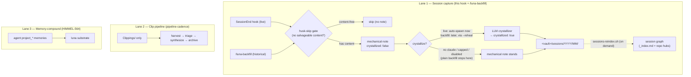

# End-Session Wiki Hook — User Guide

Auto-captures every Claude Code session as a structured note in the Luna Obsidian vault. Built by epic #7 (tasks #24-#27). For the on-disk note shape, see [`end-session-wiki-schema.md`](./end-session-wiki-schema.md).

## Quickstart — multi-vault in 30 seconds

- **Default (zero config):** sessions capture into `~/Documents/luna` **if that's a real Obsidian vault** (the luna template creates it). With no configured vault and no real `~/Documents/luna`, the hook skips rather than creating a phantom vault (HIMMEL-590).
- **One command:** run `/end-session-wiki-setup` from the code repo whose sessions you want captured — it walks the options and writes the config for you.
- **The four targeting options** (first match wins):
  1. **`vault_path`** — an absolute path, this repo only (machine-specific; don't commit on a shared repo).
  2. **`vault`** — a vault *name*, distributable and safe to commit; resolves per-machine via `~/.claude/luna-vaults.json`, else the `~/Documents/<name>` convention. **Recommended for shared repos.**
  3. **`LUNA_VAULT_PATH`** — an env var, your global default for every repo.
  4. **default** → `~/Documents/luna` (only if it's a real vault; otherwise the hook skips — no phantom vault, HIMMEL-590).

The registry (`~/.claude/luna-vaults.json`) is **optional** — you only need it for a vault that doesn't live at `~/Documents/<name>`. Full detail + examples: [Choosing the target vault](#choosing-the-target-vault).

Your first capture in a vault is an *orphan* (no inbound links) until you build the index — run `scripts/sessions-reindex.sh` once afterward (see [Connecting notes into the graph](#connecting-notes-into-the-graph)).

## What it does

On every `SessionEnd` event, a hook runs `scripts/hooks/end-session-wiki.{ps1,sh}`. It reads the session transcript + git metadata, renders a session note matching the schema, and writes it into the Luna vault at `sessions/YYYY/MM/YYYY-MM-DD-HHMM-<repo>-<branch>.md`. The hook is silent on success and never blocks session end.

**Enabled by default.** It runs automatically on every session end — no setup is needed to start capturing, and a stock install writes into `~/Documents/luna`. Opt out per-session or per-repo (see [How to opt out](#how-to-opt-out)); sessions shorter than `min_duration_seconds` (default 60s) are skipped so accidental opens aren't captured.

**What the note contains.** Frontmatter (repo, branch, worktree, timestamps, `duration_minutes`, `files_touched`, tags) plus six fixed sections: Summary, Decisions, Files Touched, Commands, Follow-ups, Raw Conversation (full shape: [`end-session-wiki-schema.md`](./end-session-wiki-schema.md)). Two things to expect, so a sparse note doesn't read as a bug:

- Empty sections are written as `_None._` rather than dropped — the six-section shape is always present.
- `## Decisions` / `## Follow-ups` are **scaffolding** — only as complete as the transcript made parseable, so fill them in yourself when a session mattered; and `files_touched` counts the **working-tree diff over the session window**, so a session whose work was already committed (clean tree at session end) shows `0`. Neither is a failure.

The note is delivered via the Obsidian Local REST API when an API key is available. If no key is found, or the REST PUT fails (e.g. Obsidian isn't running), the hook falls back to writing the note directly to the vault on disk — Obsidian picks up on-disk changes automatically, so capture works whether or not the plugin is up.

## Flow — three separate pipelines (don't conflate them)

Session capture is **one of three independent lanes** that touch the vault.
They're often confused; only the first writes `sessions/`:



- **Lane 1 (session capture)** routes per session to its configured vault
  (multi-vault under `--all`; no configured/real vault → skip — HIMMEL-590 F7).
  **There is no nightly pass over `sessions/`.**
- **Lane 2 (clip pipeline)** is the `pipeline-cadence` nightly/weekly/monthly and
  operates on `Clippings/` **only** — it does **not** touch `sessions/`.
- **Lane 3 (memory-compound)** compounds the agent's `project_*` memories into the
  luna substrate (HIMMEL-564) — separate again, not session notes.

**Known gap (future work):** there is no cross-session synthesis/compounding of
session **notes** yet — the `sessions/` analogue of `synthesize-clips`. That's a
distinct future ticket, separate from HIMMEL-564 (which mines agent memories).

## Crystallization (LLM upgrade)

The hook first writes a **mechanical** note: frontmatter + the six sections rendered straight from the transcript (last assistant turn → Summary, parsed commands → Commands, the git diff → Files Touched). That note carries `crystallized: false`. Immediately afterward, on every success-write path, the hook spawns a best-effort background **crystallizer** that asks a bounded `claude` run to rewrite the four prose sections — Summary, Decisions, Files Touched, Follow-ups — into a real synthesis of the session. When the body actually changes, the **script** (not the model) flips the note to `crystallized: true` (+ `crystallized_at`). All other frontmatter (date, session_id, repo, branch, worktree, source) and the Raw Conversation callout are preserved verbatim.

A note that stays `crystallized: false` is the valid mechanical baseline, **not** a failure — the crystallizer is fail-open and recoverable (see [Reheal](#reheal-recover-existing-husk-notes)).

**Mechanism — bounded `claude`, billed to Max.** The crystallizer is `scripts/luna/crystallize-note.sh`. It runs `claude "<prompt>" </dev/null` (an *interactive* bounded run, not headless `-p`), so it bills to the operator's Max plan and needs **no API key** — and is HIMMEL-128-safe. The note lives in the luna vault, **outside** the himmel repo, so the run uses **cwd = the note's directory** (which puts the note in the spawned run's workspace, so `--permission-mode acceptEdits` can auto-approve the edit), `--add-dir <transcript-dir>` (to read the transcript), and injects himmel's `auto-approve-safe-bash` PreToolUse hook by absolute path via `--settings` (the vault cwd carries no himmel project settings). Earlier versions ran in the himmel repo root and the out-of-workspace note edit silently fell through to a permission prompt that `</dev/null` EOFed — leaving the note byte-unchanged at `crystallized: false` (HIMMEL-590 F1). The spawn is fully detached (`scripts/lib/detach.sh` — `setsid`, or a double-fork on macOS) so it outlives the hook's process-group teardown; the hook never blocks on it and never exits non-zero because of it.

**Edit-confirmed flag (HIMMEL-590).** The `crystallized` flag is owned by the script, not the LLM: it compares the note's hash before/after the `claude` run and sets `crystallized: true` only when the note actually changed (the prompt forbids touching the frontmatter, so any change is a body change). A no-op run (cap hit, refusal, EOF) leaves the note byte-unchanged at `crystallized: false`; a real synthesis always flips it — so the flag can never be falsely set, and a hermetic test asserts the spawn's workspace shape so the F1 boundary regression can't return.

**Recursion guards.** The throwaway crystallizer session must not re-fire the session-end hooks. `crystallize-note.sh` exports two env vars into the spawned `claude`:

| Env var | Effect |
|---------|--------|
| `CLAUDE_END_SESSION_WIKI=0` | Silences this hook in the crystallizer subsession (no nested capture). |
| `HIMMEL_WHERE_ARE_WE=0` | Silences the where-are-we session-end refresh (HIMMEL-572) so a crystallizer subsession doesn't kick off a jira/gh/git ledger refresh. |

**Safety rails (best-effort, fail-open).** Any unavailability leaves the mechanical note untouched and exits 0:

- **No `claude` on PATH** → no-op (the mechanical note stands).
- **Concurrency cap** (`CRYSTALLIZE_MAX_CONCURRENCY`, default 2) — never piles up N full `claude` processes for N simultaneous session-ends; over the cap → skip.
- **Retry-read** — the live hook may have just written the note via the Obsidian REST API (async flush); the crystallizer retries the read a few times before giving up.
- **Already crystallized** → no-op.

**Husk-skip (the empty-note gate).** A session with no salvageable content — no assistant text, no thinking/tool_use, no extracted commands — would render a content-free "Transcript unavailable" husk. The hook (and backfill) detect this (`HAS_CONTENT==0`, plus `files_touched==0` for the live hook) and **skip the write entirely**, logging `skipped: husk (no content)`. A thinking/tool-only session (real work, no final prose turn) is **not** a husk: its Summary surfaces the command activity instead.

**Disable crystallization** (keep mechanical capture): set `"crystallize": false` in `.claude/end-session-wiki.json`. The mechanical note is then the final note. Pin a model with `"crystallize_model"`.

### Reheal — recover existing husk notes

If husk notes already exist in a vault (e.g. captured before the husk-skip gate landed, or sessions whose crystallizer didn't run), `backfill-sessions.sh --reheal` recovers them. It scans the resolved vault's `sessions/**/*.md` for **husk notes** — frontmatter `crystallized` is not `true` **AND** the Raw Conversation contains `_Transcript unavailable._` **AND** Files Touched is `_None._` — locates the matching transcript by `session_id` under `~/.claude/projects/*/`, and:

- if the transcript now has salvageable content → overwrites the note in place via the crystallizer (or, when `claude` is unavailable, a **mechanical re-render** — but only when the transcript has a final assistant prose turn, which is what clears the "Transcript unavailable" marker; a tool/thinking-only session can only be lifted by the LLM crystallizer);
- if the transcript is genuinely contentless, missing, or only mechanically un-liftable this run → leaves the husk as-is (a later run with `claude` available crystallizes it).

Idempotent: a healed (`crystallized: true`) note — and any note a mechanical pass can't lift — is left byte-unchanged on re-run (no rewrite loop). Inert husks persist — there is no auto-delete. See [`/luna-backfill --reheal`](../../.claude/commands/luna-backfill.md).

## Security note — log files contain raw transcript text

The hook writes diagnostic output to `.claude/end-session-wiki.log` and (during dry-run mode) the full rendered note including the `## Raw Conversation` callout that quotes the tail of your session transcript. Anything you typed into Claude — pasted credentials, API keys, secrets — can appear verbatim in those logs.

These files are gitignored by default. Do not commit them. If you copy them off-disk for debugging, redact secrets first.

## How to opt out

Two equivalent controls — pick whichever matches your scope.

**Env var (per-shell or per-session):**

```powershell
# Disable for this Claude Code session only:
$env:CLAUDE_END_SESSION_WIKI = "0"
claude
```

```bash
# Disable for a one-off run:
CLAUDE_END_SESSION_WIKI=0 claude
```

Accepted off-values (case-insensitive): `0`, `false`. Anything else (including unset) leaves the hook enabled.

**Repo config (persistent, per-repo):**

Edit `.claude/end-session-wiki.json`:

```json
{
  "enabled": false,
  "dry_run": false,
  "min_duration_seconds": 60,
  "crystallize": true
}
```

Fields:

| Field | Type | Default | Effect |
|-------|------|---------|--------|
| `enabled` | bool | `true` | `false` → hook exits 0 after logging `skipped: config disabled` |
| `dry_run` | bool | `false` | `true` → render note to log file instead of writing to vault |
| `min_duration_seconds` | int | `60` | Sessions shorter than this are skipped (prevents capturing accidental opens) |
| `crystallize` | bool | `true` | `false` → never spawn the LLM crystallizer; the mechanical note is the final note. See [Crystallization](#crystallization-llm-upgrade). |
| `crystallize_model` | string | _(absent)_ | Pin the crystallizer to a specific model (e.g. `"claude-haiku-4-5-20251001"`). Absent → the crystallizer's default model. |
| `vault_path` | string | `""` | Absolute path (a leading `~/` is expanded) to the Obsidian vault this repo's sessions are captured into. Empty → fall back to `vault`, then `LUNA_VAULT_PATH` env, then the default. See [Choosing the target vault](#choosing-the-target-vault) below. |
| `vault` | string | _(absent)_ | Vault **name** (not a path) — e.g. `"salus"`. Distributable/safe to commit; resolved to a path per-machine (registry, then the `~/Documents/<name>` convention). An invalid or unresolvable name **skips** the capture rather than misrouting it. See [Choosing the target vault](#choosing-the-target-vault). |

Missing file → defaults applied (`enabled: true`, `dry_run: false`, `min_duration_seconds: 60`); `vault_path`/`vault` absent.

> **Write this file as UTF-8 _without_ a BOM.** A leading byte-order mark makes the hook treat the config as invalid JSON and **fail closed — it silently stops capturing** (HIMMEL-408). On Windows, PowerShell 5.1's `Set-Content -Encoding utf8` _adds_ a BOM; use `-Encoding utf8NoBOM` (PowerShell 7+) or an editor that omits it. `/end-session-wiki-setup` and hand-edits in most editors are fine.

## Choosing the target vault

Your vault almost certainly does not live where the operator's does, and you may keep more than one (e.g. a general vault plus a project-specific one). The hook resolves the target vault in this order — **first match wins**:

1. **`vault_path` in `.claude/end-session-wiki.json`** (per-repo, absolute path) — the most specific, highest priority. An absolute path is machine-specific, so prefer `vault` (below) for anything you commit and share.
2. **`vault` name in `.claude/end-session-wiki.json`** (per-repo, **distributable**) — a vault *name* instead of a path, so the same committed config works on every machine. Resolved per-machine: first the operator registry `~/.claude/luna-vaults.json`, else the convention `~/Documents/<name>`. The convention target must be a real vault (contain an `.obsidian/` folder); a name that resolves to no real vault — or fails validation (1–64 chars, must match `[A-Za-z0-9._-]`, start alphanumeric, no `/` or `..`) — **skips the capture rather than misrouting it** (logged as `skipped: vault …`). A config file that exists but is **not valid JSON** also skips (fail-closed) rather than falling through to the default, so a malformed config can't silently leak a sensitive repo's sessions into the general vault.
3. **`LUNA_VAULT_PATH` environment variable** (global) — your default vault for everything that doesn't override it per-repo. Set it in your shell profile or your `.env` (see `.env.example`).
4. **Built-in default** — the `luna` vault: the `luna` entry in `~/.claude/luna-vaults.json` if you have one, else the `~/Documents/luna` (`$HOME`/`$USERPROFILE`) convention. The bare convention is honored **only when it is a real vault** (contains an `.obsidian/` folder), so a stock luna install works with zero config. With no configured vault **and** no real `~/Documents/luna`, the hook **skips** (logged `skipped: vault unresolved …`) rather than materializing a phantom vault for someone who never set luna up (HIMMEL-590). An explicit `luna` registry entry is honored as-is (no existence check), like `vault_path`.

`vault_path` configures a path (renaming/moving the vault means updating that path). `vault` configures a name and each machine resolves the path — so the same committed value works everywhere: an operator either follows the `~/Documents/<name>` convention (zero extra config) or maps the name in their registry.

**Set the target interactively** with the `/end-session-wiki-setup` command — run it from your code repo and it writes the value for you (any of the options above). The luna template setup (`templates/luna-second-brain/scripts/setup.{sh,ps1}`) prints the same options after a fresh install but doesn't write them. Or configure by hand:

```json
// .claude/end-session-wiki.json — capture THIS repo's sessions into a specific vault (absolute path)
{ "vault_path": "~/Documents/my-vault" }
```

```json
// .claude/end-session-wiki.json — distributable: route by vault NAME (safe to commit)
{ "vault": "salus" }
```

```json
// ~/.claude/luna-vaults.json — per-machine name→path map (optional;
// only needed for vaults that don't live at ~/Documents/<name>)
{ "vaults": { "salus": "~/Documents/salus" } }
```

```bash
# .env or shell profile — global default vault for all repos
LUNA_VAULT_PATH="$HOME/Documents/my-vault"
```

## Logs

Path: `.claude/end-session-wiki.log` (repo-local).

Every hook invocation appends one line: `[<UTC-ISO timestamp>] <message>`. Messages include `wrote <path> (<ms>ms)`, `skipped: <reason>`, and `ERROR: <detail>` (for failed vault writes). In dry-run mode, the full rendered markdown is appended between `===` separators so you can inspect the exact note that would have been written.

**Rotation:** when the log exceeds 1 MB, it is renamed to `.claude/end-session-wiki.log.old` (overwriting any prior `.log.old`) and a fresh log begins on the next write. Only the two most recent files (`.log` + `.log.old`) are retained.

## Inspecting captured notes

Notes live under `<luna-vault>/sessions/YYYY/MM/`. Default vault root: `$HOME/Documents/luna`, overridable per-repo with `vault_path` or `vault` in `.claude/end-session-wiki.json`, or globally with `LUNA_VAULT_PATH` (see [Choosing the target vault](#choosing-the-target-vault)).

Search across captured sessions via the Obsidian MCP:

```
mcp__obsidian-vault__obsidian_simple_search query:"end-session-wiki"
```

Or filter by branch in the file path: `sessions/2026/05/2026-05-18-*-feat-end-session-wiki-*.md`.

## Connecting notes into the graph

The hook files each note but does not maintain an index, so a fresh capture is an *orphan* (no inbound links) and its `[[<repo>]]` preamble link dangles until a hub note exists. Run `scripts/sessions-reindex.sh` to fix both, idempotently:

```bash
bash scripts/sessions-reindex.sh                       # default ~/Documents/luna
bash scripts/sessions-reindex.sh --vault ~/Documents/salus
```

It regenerates `<vault>/sessions/_index.md` (links every session note → no orphans) and creates a `sessions/<repo>.md` hub for each repo that doesn't already resolve `[[<repo>]]` somewhere in the vault. Lean-invoke: run on demand after a batch of captures (or wire it into the clip-pipeline cadence).

## Disabling per-session

One-shot disable for a single Claude run, no config edit needed:

```powershell
$env:CLAUDE_END_SESSION_WIKI = "0"; claude
```

```bash
CLAUDE_END_SESSION_WIKI=0 claude
```

The env var takes precedence over the config file — useful for throwaway exploration sessions or when you want to verify the hook's no-op path without editing repo state.
