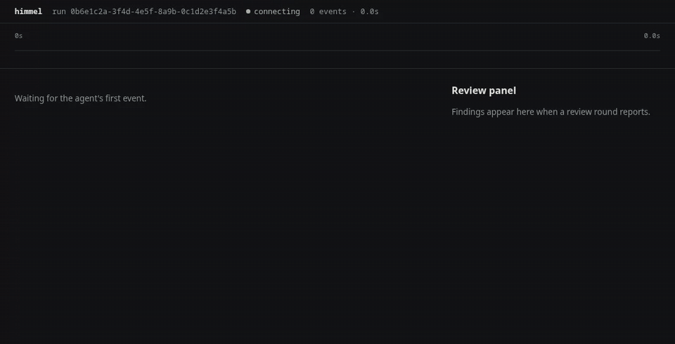

# config-ui

`himmelctl ui` serves the config console on `127.0.0.1` (Bun, loopback only,
per-launch token). Operator-only: it refuses to start inside a Claude session
(HIMMEL-4350).

## The config feed (HIMMEL-4807)

The Config page reads `GET /api/feed`: one `himmelctl report --json` shared by
every request (about two minutes on the station, most of it the doctor).

- **Progress.** The report runs under `probe-progress.cjs` (`node --require`),
  which writes one stderr line per source as it starts:
  `himmel-probe {"i":2,"n":8,"source":"doctor checks"}` (install items, doctor
  checks, each cadence, plugin profile, then lanes, initiative legs, flags and
  secrets). The steps are inferred from the report's spawns, in its fixed order.
  While it runs, a `202` carries `progress` and answers as soon as the step
  changes, and the page shows `probing <source> (i of N)` over a progress bar.
- **Background loading.** `himmelctl ui` starts the report at launch, so it is
  ready by the time you go from Fleet to Config. While the console is in use
  (any authenticated request in the last 10 minutes) the server refreshes it
  every 10 minutes; once you close it, nothing runs and the server still idles
  out. The page asks again when you come back to Config or the tab becomes
  visible, never on a timer.
- **Stale while revalidate.** Once one report has landed, `/api/feed` answers
  the newest one at once and refreshes it behind the scenes after 30 s. An
  action drops it: the next feed waits for a report started after the action.

## Health page (HIMMEL-4405, `#/health`)

Read-only: every value is rendered from its owner and nothing is re-measured.
`GET /api/health` (token-gated, GET only) runs three sources in parallel; each
answers `ok`, `absent` or `error` on its own, so one missing source never blanks
the page.

| Section | Source | `No data` means |
|---|---|---|
| Is himmel healthy? | the doctor feed's fail/warn rows plus firing Prometheus alerts | feed still running → `No data`; no Prometheus → `alerts not checked` and `monitoring tier not running` (it never raises the verdict) |
| What is broken | feed rows with health `fail` or `warn`, worst first, plus firing alerts | feed still running |
| Scheduled jobs | feed rows with `source: cadence` | no cadence rows declared |
| Legs and the usage bank | bank: the newest row with bank numbers in the last 64 KiB of `$CADENCE_BANK_LEDGER` (default `~/.himmel/cadence-ledger.jsonl`), never a fresh `bank-preflight`; legs: `legs.sh` (newest `*.fleet.json` under the handover root, status from `leg_tail_status`) | no ledger row with bank numbers; no handover root or fleet manifest |
| Search and graph freshness | feed rows with `bundle: search` (doctor owns qmd freshness) | doctor reports no search rows |

Verdict: any `fail` row or a firing `severity="page"` alert → **Act now**; any
`warn` row or any firing alert → **Needs a look**; else **All clear**.
Monitoring URLs are loopback-only (`HIMMEL_PROMETHEUS_URL`, default
`http://127.0.0.1:9090`; flow exporter port `HIMMEL_FLOW_EXPORTER_PORT`, default
9877); a non-loopback URL is refused.

## Tool health page (HIMMEL-4816, `#/toolhealth`)

`GET /api/tool-health` is token-gated and GET-only. It reads the registered
`eval-runs` and `leg-failures` ledgers: the server, not the browser, rolls up
calls, failures, error rates and count-weighted known recovery outcomes.
Filter by model, launch lane, leg-vs-console role and 7/30 UTC calendar days.
The tool table includes daily trends, top failure classes and links to the
session view with tool-call ids. Deny-hook rates use Bash calls as their
explicit denominator. The comparison table shows calls per 100 calls,
error/denial/recovery rates per lane and deltas relative to native.

No ledger means **No data**. Old digest rows without per-tool counts show
**—**, not 0 %, including summaries that mix old and new rows. Partial or
inconclusive digests also lack complete call denominators. Unknown
recovery outcomes are excluded; trend gaps have no denominator. Day-level
cohorts cannot certify an intraday shift cutoff, so those denominators stay
unknown. Lane comes only from launch metadata, never from a model name;
a document fallback reads the assigned leg's title, not sibling mentions. Ledger overrides:
`HIMMEL_EVAL_RUNS_LEDGER`, `HIMMEL_LEG_FAILURES_LEDGER`.

## Agent run view (AG-UI, HIMMEL-4480)

`agui-web/` is a React page that renders an agent run streamed as AG-UI events:
assistant text, tool-call cards, a run strip of parallel calls over time, and
the review panel driven by `STATE_SNAPSHOT` / `STATE_DELTA`. It reads
`/api/agui/<run>` (one constant, `AGUI_URL` in `agui-web/src/stream.ts`) with
the session token from `#t=<token>&run=<id>`; with no `run` it replays the
recorded fixture `agui-web/src/fixture.json`, so it previews without a server.

**Who did what, and where it failed** (HIMMEL-4669). Every text and call
belongs to an agent: the session's own (named by its `agent-name` record: a
`-console`, a leg's `-N<digits>-`, a judge) or a subagent (named by the Agent
call that spawned it: its description, `subagent_type` and model). Each agent
has a colour, a band in the run strip, and a row in the **Agents** list that
shows its role, model, call count and failure count; click a row to show only
that agent. The transcript runs in turns, and one agent's consecutive work sits
under its name, a subagent's one step in. Failures are marked by kind: `error`
and `suite failed` (a test run that exited non-zero) in red, `denied` (a hook or
permission refusal) and `blocked` (a BLOCKED report, by message or in text) in
amber. The top bar counts them, and ↑ / ↓ next jumps to each in turn. Long tool
output shows its first 12 lines with a control for the rest.

```bash
cd scripts/config-ui/agui-web
bun install
bun run build   # → agui-web/dist/ (untracked)
```

`GET /api/agui/<run>` (token-gated, GET only, `agui/sse.ts`) serves that
stream. `<run>` must be a lowercase session UUID (else `400`); it names exactly
one `~/.claude/projects/<slug>/<run>.jsonl` whose real path stays under
`~/.claude/projects` (none `404`, more than one `409`; a symlink that leaves the
tree does not count). The response is `text/event-stream`, one
`data: <json>` frame per AG-UI event (the `@ag-ui/encoder` wire format,
hand-encoded: config-ui takes no dependency for it). It maps the file from the
start, then polls for appends every 500 ms, and ends when the client goes away,
2 minutes after the file stops growing with no run open, or after 4 hours. A
`: keepalive` comment every 15 s holds a quiet stream past Bun's idle cut. It
also follows the session's subagent transcripts
(`<run>/subagents/agent-<id>.jsonl` beside the journal, at most 64, each one's
real path inside the journal's directory) and merges their lines with the
journal's in timestamp order. Payload fields (deltas, results, errors, state)
pass the same redactor as the feed; the id fields are left intact, and so are
`agent` (who acted: a session name is often 32+ characters, which the redactor
would blank) and `failure` (one of four words).

`GET /agui/` serves the built page from `agui-web/dist` (`/agui` redirects
there) with the same CSP and frame headers as every other page. It serves only
regular files whose real path stays inside `dist`, so traversal, a symlink out
and a directory are `404`; when `dist` is not built it answers `404` with the
build steps. The page itself is not token-gated (the token rides the URL
fragment, never a request line); `/api/agui/<run>` stays gated.

### Watching a live run (operator steps)

From your own terminal, outside Claude, in the himmel checkout:

```bash
# 1. build the page once (and again after agui-web/src changes)
cd scripts/config-ui/agui-web
bun install
bun run build
cd ../../..

# 2. start config-ui and print the AG-UI URL for the newest session
node scripts/himmelctl/bin.js ui --port 0 --agui latest
```

It prints one URL, `http://127.0.0.1:<port>/agui/#t=<64 hex>&run=<session-id>`.
`--agui latest` picks the newest `~/.claude/projects/*/<id>.jsonl` by
modification time; `--agui <session-id>` picks one session. The server runs in
the foreground (Ctrl-C to stop); an open stream keeps it from idling out.

**Fleet view (HIMMEL-4712).** `--agui` with no session id prints the fleet URL,
`http://127.0.0.1:<port>/agui/#t=<64 hex>` (the token, no `run`): one row per
live Claude session (console, leg, judge or interactive) with its ticket and PR,
state (running, idle, waiting for GO, wrapped), latest tool call and its age,
subagent counts and failure count. Wrapped legs sit in a closed section, never
in the live list. Clicking a row's name opens that session's run page. The page polls
`GET /api/agui/fleet` (token-gated, GET only, read-only, `agui/fleet.ts`),
whose census is `fleet.sh`: `claude_sessions` plus each leg doc's last marker
(`leg_tail_status`). A session whose journal has been quiet for an hour is left
out.

**Cloud sessions (HIMMEL-4791).** A `claude --cloud` session has no local
process, so its node comes from the console buckets' `cloud-route.jsonl` (each
ticket's newest routing across them; a CLOUD-OK from the last 72 hours) plus its
PR on GitHub: the newest PR whose title cites the ticket, and the `CLOUD-DONE` /
`CLOUD-BLOCKED` comment carrying the session link. It hangs under the console
its brief names, and a local leg on the same ticket (its shepherd) hangs under
it. Its tokens read "not measured": no source exposes a cloud session's usage.
GitHub is read in one batched GraphQL query per minute at most
(`agui/fleet-cloud.ts`, shared and cached); a failed or throttled read, or one
still running after 2 seconds, shows the nodes as "GitHub status unknown" for
that poll and never holds up the page longer.

**Sections, orphans and filters (HIMMEL-4925).** The page has four sections:

- **Needs attention** lists sessions that want a console action, by severity:
  - a `BLOCKED` or `FINDING` marker;
  - context at 85 % or more of the session's real window (the launch's declared
    `CLAUDE_CODE_MAX_CONTEXT_TOKENS`, then `--autocompact`, then the model's);
  - a `CLOUD-DONE` PR awaiting its shepherd.
- **Orphans** lists live sessions no live console watches, with the reason and
  "adopt via relay / close". It also lists the shell-tool wrappers the console
  tick reports, read from the console kit's `orphan-loops.sh --list`, with pid,
  owner, age and how to close each. The page never signals a process.
- **Running** groups sessions per live console.
- **Finished** is closed by default.

Cloud is a lane like native and claudex. A cloud session is never an orphan for
want of a shepherd.

Each card is one line: its name links to the run page (a cloud session's to its
cloud session) and its chevron expands the status and lineage detail. A leg's
hops (`N1494`, `N1494b`, `-RESUME`) and a console's succession chain each fold
into one entry, with every hop linked.

The rail's filters (lane, state, text, finished inline) narrow every section.
They are kept per viewer in the browser.

A finished row links its PR to this checkout's GitHub origin
(`CONFIG_UI_GITHUB_REPO=<owner>/<name>` overrides it).

**One app (HIMMEL-4711).** The console and the AG-UI pages share one rail and one
theme (`public/nav.js`, `public/theme.css`): Config, Health and Fleet, plus Run
on a run page. Plain `himmelctl ui` prints ONE URL and lands on the fleet when
`agui-web/dist` is built, on the console when it is not; `LANDING` in
`server.ts` is the one-line switch (`"config"` lands on the console). The token
only ever travels in the URL fragment: the console reads `#t=<token>[&page=<id>]`
and clears it from the address bar, the AG-UI page keeps `#t=<token>`, and
requests carry it in the `X-Himmel-Token` header. The rail's Fleet dot is the
census health (ok, degraded = warn, unavailable or unreachable = fail, not yet
read = off), in the status colours; on the console it is read on load and on
each page change, never polled, so an open console still idles out. A leg's
fleet row also links to the Health page (its legs and bank cards).



*A live stream over the real SSE path, not a mock: a fixture session journal and
its subagent's transcript are appended to while the page is open, and the page
renders each event as the server pushes it.* Regenerate it from your own terminal (needs `ffmpeg`, the
built `agui-web/dist`, and Playwright's Chromium build 1243):

```bash
bash scripts/config-ui/tests/e2e/record-agui-gif.sh
```

The view logic is a pure reducer (`agui-web/src/reducer.ts`) with no runtime
imports, so its suite runs in CI without an install.

## Tests

- Unit and server suites: `bun test scripts/config-ui --dots` (CI-gated).
  `probe-progress.test.ts` drives the preload with a fake report;
  `feed-background.test.ts` covers the progress `202`, the launch prewarm, the
  in-use refresh and stale-while-revalidate.
- Toggles end to end (HIMMEL-4807, `toggles.test.ts`, CI-gated, skipped on
  Windows): every console toggle through the real `himmelctl` and the real
  server routes (preview, run), checking that the setting is written, that its
  owner reads it back, and that the run's re-probe and a fresh feed show it,
  then the opposite flip. It runs against a temp `HOME` and a temp repo of
  symlinks, with fake `crontab`, `claude`, `qmd` and `graphify` and a stub
  doctor, so the checkout's `.env`, `lanes.local.json`, crontab and plugins are
  never touched. CI flips one plugin and one lane (same argv for each);
  `CONFIG_UI_TOGGLES_ALL=1` flips every one. Results:

  | Toggle | Works end to end? |
  |---|---|
  | cadence arm/disarm (pipeline, qmd, graphmap, doctor; codex-sweep is Windows-only) | yes: a crontab entry, `status` reads `ARMED` / `not armed`, the row flips |
  | initiative on/off (execute, prcheck, pr, ticket, handover) | yes: `HIMMEL_INITIATIVE` in `.env`, `config get` and the SessionStart hook agree, the row flips |
  | plugin enable/disable (on-demand tier) | yes: user scope flips, `plugin-profile.sh list` agrees, the row flips |
  | lane on/off | written and read back (`probe.kind` always / never), but **the row cannot show which**: it reads `local override in lanes.local.json` for both (config-feed.js `laneRows`) |

  `profile.set` is in the action table, but no feed row offers it, so it is not
  a console toggle. Served from a git **worktree**, initiative and lane toggles
  look like they did nothing: `config set` writes the worktree's `.env` and
  `lanes.local.json`, while the feed reads the primary checkout's (its station
  anchor).
- Browser e2e (HIMMEL-4400): `scripts/config-ui/tests/e2e/`, Playwright pinned
  to 1.63.0 (Chromium build 1243). **Opt-in, not in CI**: a runner has no
  cached Chromium, and fetching one on every PR would make a download outage
  red-flake the fleet. Run it where `~/.cache/ms-playwright` already holds
  build 1243:

  ```bash
  cd scripts/config-ui/tests/e2e
  bun install
  bunx playwright test
  ```

  Each test boots its own real `himmelctl ui --port 0` against a fixture feed
  (stub via `CONFIG_UI_HIMMELCTL`; the live station feed never runs). The
  bundle order comes from `scripts/himmelctl/lib/feed-bundles.json`.
  `E2E_BREAK=order` feeds a mis-ordered bundle list: the suite must go red.
  HIMMEL-4807 adds the probe progress bar (a held report writes four steps) and
  background loading (Fleet first, then Config in a new tab: the report is
  already there).
- AG-UI page e2e (HIMMEL-4480, `agui.e2e.ts`, same opt-in suite): needs
  `agui-web/dist` built (see above; the tests skip when it is absent). Each
  test boots `himmelctl ui --agui` against a temp `HOME` and appends journal
  lines while the page is open, asserting the live render, the wrong-token
  error state, and both themes at desktop and phone width. HIMMEL-4669 adds
  a leg with a critic subagent (`SCENE` in `agui-fixtures.ts`, also the GIF's
  run): agent attribution and the filter, failure marking and the jump
  control, and the long-output control. HIMMEL-4712 adds the fleet landing
  over a fixture fleet (`agui-fleet-fixture.ts`: 3 live sessions and 1
  wrapped) and the click through to a run. HIMMEL-4711 adds the walk console to
  Fleet to a run and back over the shared rail, and checks no request line
  carries the token.

## Manual pass (the same 7 items)

From your own terminal (not inside Claude):

```bash
node scripts/himmelctl/bin.js ui --port 0
```

Open the printed URL, `http://127.0.0.1:<port>/#t=<64 hex>` (the token rides
the fragment). The first report can take a couple of minutes.

- [ ] 1. Controls and Inventory render as bundles in table order (Search & graph … Install & toolchain).
- [ ] 2. A bundle with no fail or warn row is collapsed; one with a fail or warn row opens by default.
- [ ] 3. Each header shows its headline health plus only the non-zero counts (Bypass flags reads `48 off`).
- [ ] 4. "Show only problems" hides healthy rows; header counts read `n of N`.
- [ ] 5. Searching `C45` opens Search & graph with the hit row; clearing restores the default state.
- [ ] 6. Tab to a header; Enter or Space toggles it; focus stays on that header after the repaint.
- [ ] 7. Unsorted is absent with 0 unmapped rows; when one exists it is always open and last.
- [ ] Header: above the page, one line shows `himmel <version> · <describe>`, the 12-char commit, the served checkout and the feed time; a feed without `himmel` reads `version unknown (feed has no himmel identity)`.
- [ ] Page links: the rail lists the pages (Config, Health and Fleet, with the Fleet dot in a status colour), the current one is highlighted, and the address bar reads `#/config` (the token never stays in the URL).
- [ ] Safety: click a toggle: only a dry-run plan appears; confirm stays disabled until you type the target; cancel clears it.
